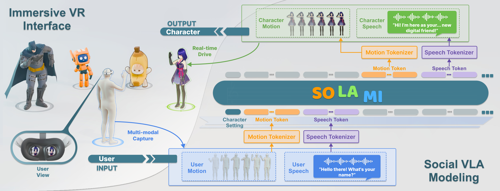
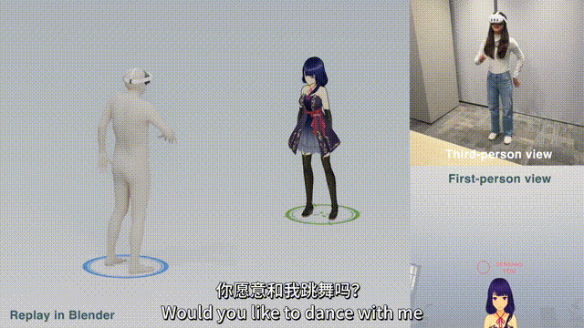

# SOLAMI: Social Vision-Language-Action Modeling for Immersive Interaction with 3D Autonomous Characters

<div align="center">
    <a href="https://solami-ai.github.io/" class="button"><b>[Homepage]</b></a> &nbsp;&nbsp;&nbsp;&nbsp;
    <a href="https://arxiv.org/abs/2412.00174" class="button"><b>[arXiv]</b></a> &nbsp;&nbsp;&nbsp;&nbsp;
    <a href="https://www.youtube.com/watch?v=P0juJl2Y4So" class="button"><b>[Video]</b></a>
&nbsp;&nbsp;&nbsp;&nbsp;
</div>

Official Code of SOLAMI for CVPR 2025 paper *SOLAMI: Social Vision-Language-Action Modeling for Immersive Interaction with 3D Autonomous Characters*.





<div align="center">

<!--  -->

|      Various Characters  |     Comprehension of Body Language    |  Execution of Motion Commands  | Engagement in Interactive Tasks|
| :------------------------------: | :------------------------------:| :------------------------------:| :------------------------------:|
|  |  |   |   |

</div>


## License and Usage Notices
In this repository, we provide code for raw data preprocessing, multimodal data synthesis, SOLAMI model training, model evaluation, VR Unity client and server code for community reference.
Considering that we used some company internal data to train the models in the original paper, we are not open-sourcing the raw data and trained models. Users can use their own collected data to train their deployable models on advanced end-to-end multimodal models.


**Usage and License Notices**: This project utilizes certain datasets, 3D assets, and checkpoints that are subject to their respective original licenses. Users must comply with all terms and conditions of these original licenses, including but not limited to the [OpenAI Terms of Use](https://openai.com/policies/terms-of-use) for generating synthetic data scripts, [Llama community license](https://ai.meta.com/llama/license/) for foundation language models, [SMPL-X](https://smpl-x.is.tue.mpg.de/) for original motion format, and [HumanML3D](https://github.com/EricGuo5513/HumanML3D), [Inter-X](https://github.com/liangxuy/Inter-X), [DLP-MoCap](https://digital-life-project.com/), [AnyInstruct](https://huggingface.co/datasets/fnlp/AnyInstruct), [CommonVoice](https://commonvoice.mozilla.org/) for data generation and model training. This project does not impose any additional constraints beyond those stipulated in the original licenses. Furthermore, users are reminded to ensure that their use of the dataset and checkpoints is in compliance with all applicable laws and regulations.


## Contents
- [Install](#install)
- [Data](#data)
- [Model Training](#model-training)
- [Evaluation](#evaluation)
- [VR Demo](#vr-demo)

## Install

Environment with Linux 18.04 LTS and cuda 11.8 is tested in our experiment.

Step 1: Install pytorch 

```
conda create -n demo python=3.11
conda activate demo
pip install torch==2.2.2 torchvision==0.17.2 torchaudio==2.2.2 --index-url https://download.pytorch.org/whl/cu118
pip install -U openai-whisper
pip install -r requirements.txt
```

Step 2: Install [TTS](https://github.com/coqui-ai/TTS)

Please follow the instructions from [TTS](https://github.com/coqui-ai/TTS) to install this package. TTS will downgrade numpy.
After you have installed TTS, please install spacy and upgrade numpy.

```
pip install -U spacy
python -m spacy download en_core_web_sm
pip install numpy==1.26.4
```

(Optional) Step 3: Install [vllm](https://github.com/vllm-project/vllm)


## Data

Data processing is very complex work involving numerous details. The overall framework is as follows. For processing code, please refer to [Datasets](./datasets/README.md).

- Speech Data
    - Pretrain Data Preprocessing  (~ 300K items)
    - Character Data Preprocessing
- Motion Data
    - SMPL-X Preprocessing & Feature Extraction (~ 40K motion items)
    - Text Embedding Generation
    - Unified Data Item Generation
- Multimodal Generation
    - Topic Collection  (~ 4K topics)
    - Multimodal Chat Data Synthesis (~6K items)

## Model Training

Training SOLAMI requires three stages: motion tokenizer training, multitask pretraining, and multimodal chat sft. For details, please refer to [Models](./models/README.md).

### Tokenizer Training
We use the codebase of [MotionGPT](https://github.com/OpenMotionLab/MotionGPT) to train the motion tokenizer. 
For hand or body tokenizer, we apply 1D convolution as the basic layer of VQVAE. For relative transform, we use MLP layers. 
For speech tokenizer, we use the original pretrained tokenizer from[AnyGPT](https://github.com/OpenMOSS/AnyGPT).
Besides the tokenizer training, we also use GPT-2 as foundation model for initial ablation studies. 


### Multi-task Pre-training for Modality Alignment

We adopt multi-task pretraining on LLM backbone to align motion, speech, and language.
To achieve this, we train a 7B decoder-only LLM ([AnyGPT](https://github.com/OpenMOSS/AnyGPT)) on 32 V100s with [DeepSpeed](https://github.com/deepspeedai/DeepSpeed) Zero3 for one day.
During training, we fixed the params of motion & speech tokeniers and adopt full parameter finetuning.

### Stage 3: Instruction Tuning for Multi-turn Conversation

In this stage, we finetune the model with synthetic multimodal chat data to obtain social Vision-Language-Action model for immersive interaction with 3D Characters.
SOLAMI model takes the user's motion and speech (character's observation) as input, and generate the character's motion and speech as response (character's action) based on the system prompt of character settings and dialogue context.

## Evaluation

### Qualitative Evaluation

```
cd models/vla/anygpt/src/infer

python conv_inference.py  --part 0 --period 4 --model_name_or_path $MODEL_PATH --output_dir $SAVE_DIR

python conv_evaluation.py --save_gt True --data_dir $SAVE_DIR
python speech_evaluation_gpt-4o.py --data_dir $SAVE_DIR
```

### Quantitative Evaluation


## VR Demo

### VR Client
TODO

### VR Server
TODO

## Citation

```bibtex
@inproceedings{Jiang2025SOLAMI,
      title={SOLAMI: Social Vision-Language-Action Modeling for Immersive Interaction with 3D Autonomous Characters}, 
      author={Jianping Jiang, Weiye Xiao, Zhengyu Lin, Huaizhong Zhang, Tianxiang Ren, Yang Gao, Zhiqian Lin, Zhongang Cai, Lei Yang, Ziwei Liu},
      booktitle={CVPR},
      year={2025}
}

@inproceedings{Cai2024DLP,
      title={Digital Life Project: Autonomous 3D Characters with Social Intelligence}, 
      author={Zhongang Cai, Jianping Jiang, Zhongfei Qing, Xinying Guo, Mingyuan Zhang, Zhengyu Lin, Haiyi Mei, Chen Wei, Ruisi Wang, Wanqi Yin, Xiangyu Fan, Han Du, Liang Pan, Peng Gao, Zhitao Yang, Yang Gao, Jiaqi Li, Tianxiang Ren, Yukun Wei, Xiaogang Wang, Chen Change Loy, Lei Yang, Ziwei Liu},
      booktitle={CVPR},
      year={2024}
}
```

## Acknowledgement
Our code of SOLAMI is based on [AnyGPT](https://github.com/OpenMOSS/AnyGPT), [HumanTOMATO](https://github.com/IDEA-Research/HumanTOMATO), and [MotionGPT](https://github.com/OpenMotionLab/MotionGPT).

## Related Works

### Research
- [Digital Life Project](https://digital-life-project.com/)&nbsp;: First LLM-Agent framework for building 3D autonomous characters.
- [ChatHuman](https://chathuman.github.io/)&nbsp;: A multi-modal LLM for understanding humans with the assistance of tools.
- [Generative Agents](https://github.com/joonspk-research/generative_agents)&nbsp;: An architecture for interactive simulacra of human behavior.

### Products \& Company
- [SEELES](https://www.seeles.ai/)&nbsp;: End-to-end 3D game AI engine generating 3D games with a single sentence, igniting hyper-personalized social gaming.
- [MeshCapade](https://meshcapade.com/)&nbsp;: Foundation models that enable digital humans to see, understand, and move.
- [Whispers from the Star](https://wfts.anuttacon.com/)&nbsp;: AI dialogue-based text adventure game.

