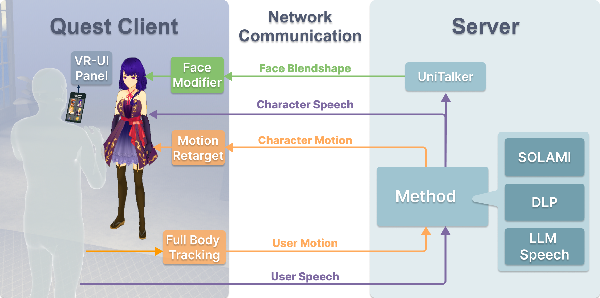

# Demos

## VR Client

The VR Client is a standalone Unity project that can be compiled for Quest 2/3/Pro and above devices. It serves as the front-end interface for users to interact with the SOLAMI system in virtual reality.

Repository: [SOLAMI-UnityClient](https://github.com/EsukaStudio/SOLAMI-UnityClient)

## VR Server

The Server acts as middleware to establish connections between the VR Client and the algorithm backend. The Server communicates with the algorithm backend through HTTP requests and with the VR Client through Redis.

Repository: [SOLAMI-VRServer](https://github.com/AlanJiang98/SOLAMI/tree/Weiye-VRServer/demos/VRServer)

For security reasons, the VR Server and the SOLAMI model are deployed on separate servers. Users can modify the code according to their requirements to improve communication efficiency.

## Audio-to-Face Algorithm

The audio-to-face animation algorithm used in this project needs to be deployed separately by users. For reference, you can check out the [UniTalker](https://github.com/X-niper/UniTalker) project, which provides a unified model for audio-driven 3D facial animation that can handle various audio domains including clean and noisy voices in different languages.

UniTalker can generate realistic facial motion from different audio inputs and is compatible with the SOLAMI system when properly configured.